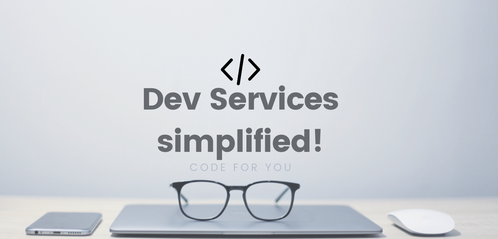
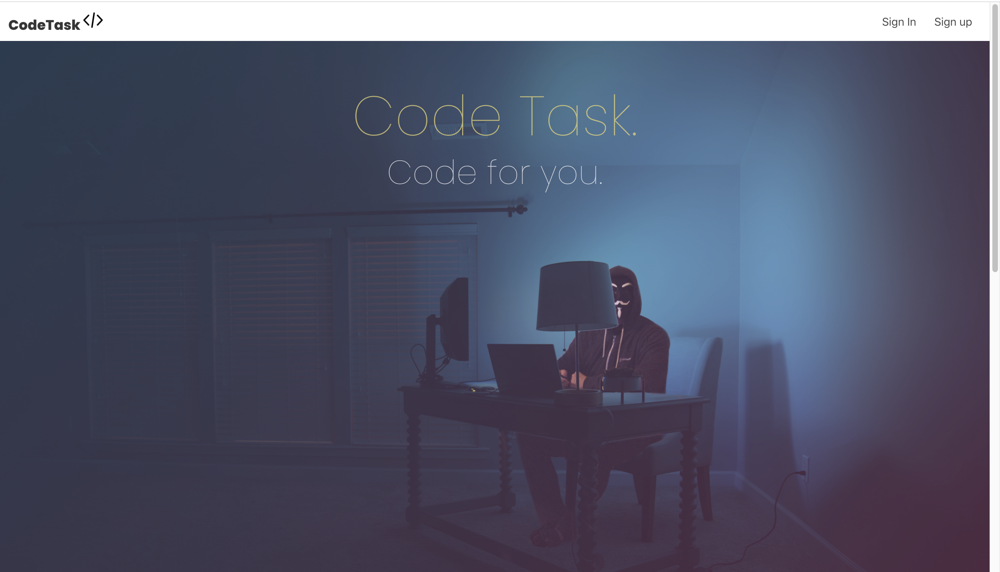

# Read Me Code Task

> R7	Identification of the problem you are trying to solve by building this particular marketplace app.



The problem CodeTask aims to facilitate is catering to the consumers who require a programmatic IT service that is out of scope for the average software development team and small business. 

Due to the lack of Development Service outlets there is an apparent gap in the market in which CodeTask could absolutely disrupt.

CodeTask boasts an eclectic array of development services from Front end, Back end, full stack, ERD design and many more. 

If you are a Developer - you can sell any service your experience entails.
And if you are a consumer, we have the cutting edge service that's right for your E-business.

> Why is it a problem that needs solving?

This problem needs an appropriate solution due to the fact there are very little designated Development Service Marketplaces available. 

This would be a groundbreaking service for small business's with tighter budgets to utilise the abundance of talent out there in the Software Development community. 

On the other side of the spectrum it's an amazing opportunity for developers to show off the skills they have, earn a potential living and build a reputation within the community via this outlet.

### Deployed App:  [https://pure-brushlands-92794.herokuapp.com/](https://pure-brushlands-92794.herokuapp.com/)

### GitHub Repository: [https://github.com/LukeMilsom/LukeMilsom-Luke-Milsom-T2A2---Code-Task](https://github.com/LukeMilsom/LukeMilsom-Luke-Milsom-T2A2---Code-Task).

> R11 Description of your marketplace app (website), including:

### Purpose

The purpose of CodeTask is to connect buyers and sellers of Software Development Services by providing a user friendly marketplace where people are able to list their services for sale as well as purchase a Programming service suited to their business.

### Functionality/Features

***UX:*** A clean, functional User Experience has been implemented throughout the marketplace. To  ensure the users stay and keep coming back to Code Task. 




***Swipe Carousel:*** A swipe carousel has been implemented to the landing page, this is mobile responsive and adds depth to the User Experience. The 'Owl Carousel' Ruby Gem coupled with JavaScript was used to Implement this feature.


***Account:*** The Devise Ruby gem has been implemented for authentication and authorisation.
 Users will need to 'Sign Up' to create an account in order to access the full site functionality. once signed up users will need to be logged in to their account to make any purchases or list their services for sale. 

Users are able to edit their account, change their password and cancel their account if they are unsatisfied. Users are also able to view each individual listing without having to be logged in.


Adding to cart: Users are able to add multiple Services to a cart from the show page, they are also able to destroy a cart or remove an item from a cart if they wish to do so.


### Sitemap


### Target Audience

The targeted clientele for CodeTask is aimed at small business's and/or starting business's that need to get software tasks off the ground fast without the hassle of verbose process's and contractual agreements. 

Essentially it's for quick and dirty coding tasks, ***fit for purpose.*** 

### Tech stack

**Front end technologies**: HTML5, CSS, SCSS, ERB, Bulma, JavaScript

**Back-end technologies**: Ruby 2.7.1 and Ruby on rails 6.0.3.4 

**Database**: PostgreSQL

**DevOps**: Git, Github, VSCode, Bundler, Homebrew, Yarn

**Business tools**: Balsamiq, ResponsivelyApp, Trello

**Deployment**: Heroku

> R12	User stories for your app

**Authentication**

- As a user, I have the ability to sign up for an account to login and become either a buyer or seller of freelance Dev Services.
- As a user, I can use my email and password to log into the site.
- As a user, I can log out of my account anytime I want.
- As a user, I can cancel my account anytime I wish.
- As a user, I can go to settings and update my account details.

**Dev Service Listings**

- As a user, I can see all dev listings displayed on index without having to log in.
- As a user, I can visit a dev listing show page or navigate to that page from the index without having to login.
- As a user (seller), I have the ability to create a listing to sell a dev service.
- As a user (seller), I can create and update my dev service listings to my liking.
- As a user (seller), I have the ability delete my show listings if I like.
- As a user (seller), I am able view a listing that tracks all the items listed for sale.

**Transactions**

- As a user (buyer), I can add multiple items to a cart.
- As a user (buyer), I have the ability to keep on browsing and shopping whilst keeping a cart session.
- As a user (buyer), I have the ability to remove items from a cart.
- As a user (buyer), I have the ability to destroy the cart if I wish.
- As a user (buyer), I would like to like a listing to be removed after purchase or if an item is not available.

**Authorisation**

- As a user, my account is my own and no one has access to it unless I allow it.
- As a user, no one else is able to edit my Dev listings.
- As a user, no one else is able to edit my Dev listings.
- As a user, no one else is able to delete my Dev listings.
- As a seller, I do not have the ability to purchase my own listings.

> R13	Wireframes for your app

***Index Page***


***Sign Up Page***


***Create A Listing***


***Show Page***


***Cart Page***


> R14	An ERD for your app

.png)

> R15	Explain the different high-level components (abstractions) in your app

***User Authentication -***

The Devise Ruby Gem was used for handling user authentication. The User model in Code Task was created with devise and includes attributes Name, Email, and password. Devise then handles this information for signing up, signing in and creating restrictions for unauthorised users, this is done with a `before_action :authenticate_user!` Devise method.

***Image Uploading -***

Carrierwave Ruby Gem was used for image/file uploading capabilities. Carrierwave creates an uploading file in which you can sanitise file input by specifying only expected data types.

This tool is working in conjunction with the MiniMagick Ruby Gem which resizes and formats images specified. 

> R16	Detail any third party services that your app will use

***Bulma:*** The Bulma styling framework has been utilised for styling and responsiveness, integrated with custom SCSS styling. 

***OwlCarousel:*** OwlCarousel Ruby Gem has been integrated into the application in order to create the landing page carousel. This is in conjunction with some custom DOM JavaScript.

***Simple form:*** The Simple Form Ruby Gem is being utilised throughout the application for handling all required form fields. 

***Google Fonts:*** Google fonts are being pulled into the application for font-family styling throughout.

***Carrierwave:*** The Carrierwave ruby gem is being used for image upload in the application. 

> R17	Describe your projects models in terms of the relationships (active record associations) they have with each other

### ***Models Used:***

Cart, Dev, Item_Selection, User.

### Associations -

- A User has many Devs and a Dev belongs to a user
- A Dev has many Item_Selections and Item_Selection belongs to a Dev
- Cart has many Item_Selections, Item_Selection belongs to a Cart

```ruby
class User < ApplicationRecord
    has_many :devs
end

class Dev < ApplicationRecord
    belongs_to :user, optional: true
    has_many :item_selections
end

class ItemSelection < ApplicationRecord
  belongs_to :dev
  belongs_to :cart
end

class Cart < ApplicationRecord
    has_many :item_selections, dependent: :destroy
end

```

> R18	Discuss the database relations to be implemented in your application

### ***User** -*

The Users table contains the primary key of 'User_ID'. 

User_ID is implemented as the foreign key in the Devs table to associate the relationship between User and Dev/'s. 

the association however is not present in the user table to ensure database normalisation


### ***Dev -***

The Devs table contains the foreign key of User_ID. This foreign key is used to associate a Dev listing to a User account. 

The entity cardinality relies on one mandatory User account to be associated to many optional Dev listings.

The Devs table holds a primary key of 'Dev_ID'. 


### ***Dev/item Selection -***

The Item Selections table contains the foreign key of Dev_ID. This foreign key is used to associate a Dev listing as an Item Selection ready for purchase, and to associate the item/quantity to an order. hence relating the tables Devs, Item Selections and Carts. 

The entity cardinality relies on one mandatory Dev Listing to be associated to many optional/no item selections. An item selection must belong to a Dev listing.


### ***Cart /Item Selection (line items) -***

The Item Selections table also contains the foreign key of Cart_ID. This foreign key is used to associate the Item Selections table to the Carts table. 

The entity cardinality relies on one mandatory to many optional. Many optional item selections must belong to one Cart.


> R19	Provide your database schema design

Below is the database schema design for CodeTask.

```ruby
ActiveRecord::Schema.define(version: 2020_11_14_014913) do

  # These are extensions that must be enabled in order to support this database
  enable_extension "plpgsql"

  create_table "carts", force: :cascade do |t|
    t.datetime "created_at", precision: 6, null: false
    t.datetime "updated_at", precision: 6, null: false
  end

  create_table "devs", force: :cascade do |t|
    t.string "dev_type"
    t.string "service_type"
    t.string "language_type"
    t.string "listing_name"
    t.text "summary"
    t.string "location_town"
    t.string "location_country"
    t.integer "price", default: 0
    t.datetime "created_at", precision: 6, null: false
    t.datetime "updated_at", precision: 6, null: false
    t.string "image"
    t.integer "user_id"
    t.json "images"
  end

  create_table "item_selections", force: :cascade do |t|
    t.bigint "dev_id", null: false
    t.bigint "cart_id", null: false
    t.datetime "created_at", precision: 6, null: false
    t.datetime "updated_at", precision: 6, null: false
    t.integer "quantity", default: 1
    t.index ["cart_id"], name: "index_item_selections_on_cart_id"
    t.index ["dev_id"], name: "index_item_selections_on_dev_id"
  end

  create_table "users", force: :cascade do |t|
    t.string "email", default: "", null: false
    t.string "encrypted_password", default: "", null: false
    t.string "reset_password_token"
    t.datetime "reset_password_sent_at"
    t.datetime "remember_created_at"
    t.datetime "created_at", precision: 6, null: false
    t.datetime "updated_at", precision: 6, null: false
    t.string "name"
    t.index ["email"], name: "index_users_on_email", unique: true
    t.index ["reset_password_token"], name: "index_users_on_reset_password_token", unique: true
  end

  add_foreign_key "item_selections", "carts"
  add_foreign_key "item_selections", "devs"
end
```

> R20	Describe the way tasks are allocated and tracked in your project

This project has been tracked and managed using Trello you can see my board here:

[https://trello.com/b/QLQ3XYLA/luke-milsom-t2a2-marketplace-project](https://trello.com/b/QLQ3XYLA/luke-milsom-t2a2-marketplace-project)

Throughout the build process the agile methodology approach has been utilised. Due to strict time limitations MVP was the course of action and scope was calculated, tracked and assessed based on priority.  

